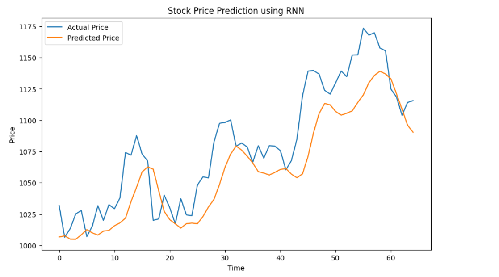
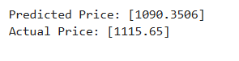

# Stock-Price-Prediction


## AIM

To develop a Recurrent Neural Network model for stock price prediction.

## Problem Statement and Dataset
Predict stock prices using an RNN model based on historical closing prices from trainset.csv and testset.csv, with data normalized using MinMaxScaler.

## Design Steps

### Step 1:
Write your own steps

### Step 2:
Load and preprocess the data.

### Step 3:
Create input-output sequences.

### Step 4:
Convert data to PyTorch tensors.

### Step 5:
Define the RNN model.

### Step 6:
Train the model using the training data.

### Step 7:
Evaluate the model and plot predictions.


## Program
#### Name: BHAVYASHREE R
#### Register Number: 212223110006
```
class RNNModel(nn.Module):
  def __init__(self, input_size=1, hidden_size=64, num_layers=2, output_size=1):
    super(RNNModel, self).__init__()
    self.rnn=nn.RNN(input_size,hidden_size,num_layers,batch_first=True)
    self.fc=nn.Linear(hidden_size,output_size)
  def forward(self,x):
    out,_=self.rnn(x)
    out=self.fc(out[:,-1,:])
    return out

model = RNNModel()
device = torch.device("cuda" if torch.cuda.is_available() else "cpu")
model = model.to(device)

criterion=nn.MSELoss()
optimizer=torch.optim.Adam(model.parameters(),lr=0.001)

epochs=20
model.train()
train_losses=[]
for epoch in range(epochs):
    epoch_loss=0
    for x_batch,y_batch in train_loader:
      x_batch,y_batch=x_batch.to(device),y_batch.to(device)
      optimizer.zero_grad()
      outputs=model(x_batch)
      loss=criterion(outputs,y_batch)
      loss.backward()
      optimizer.step()
      epoch_loss+=loss.item()
    train_losses.append(epoch_loss/len(train_loader))
    print(f"Epoch [{epoch+1}/{epochs}], Loss: {train_losses[-1]:.4f}")
```

## Output

### True Stock Price, Predicted Stock Price vs time


### Predictions 


## Result
Thus, the RNN model to forecasts future stock prices using historical closing data is developed. The predicted values closely align with actual prices, showcasing the model's ability to recognize temporal trends.

